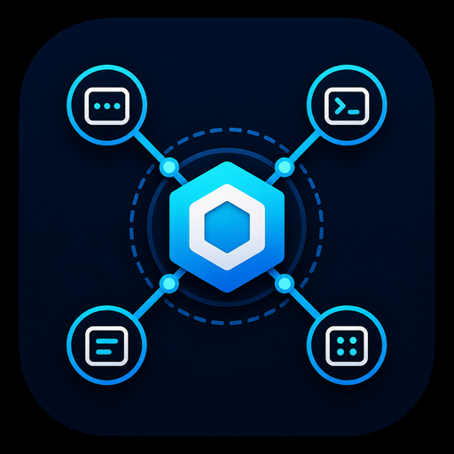

<p align="center">
  
</p>

# n2n-nexus

Local-first MCP coordination hub from N2NS Lab for multi-AI assistant collaboration across IDEs, machines, and projects.

[](https://www.npmjs.com/package/n2n-nexus)
[](https://www.npmjs.com/package/n2n-nexus)
[](https://github.com/n2ns/n2n-nexus/blob/main/LICENSE)
[](https://modelcontextprotocol.io)
[](https://nodejs.org)

[中文版](./docs/README_zh.md)

---

> **One daemon. Many assistants. Shared project state.**

n2n-nexus is an open-source Model Context Protocol (MCP) coordination server for developers and teams who use multiple AI coding assistants across IDEs, machines, and projects. Use it when Claude Desktop, Claude Code, Cursor, VS Code, Windsurf, JetBrains, or other MCP-enabled clients need a shared local coordination layer instead of isolated per-chat context.

## 💡 What is n2n-nexus?

n2n-nexus gives AI assistants a shared coordination workspace. A long-running local daemon owns project state, meetings, messages, tasks, shared docs, and project assets. Lightweight MCP adapters connect each IDE or assistant to the same daemon.

- Coordinate multiple AI assistants working on the same project.
- Share project manifests, decisions, and assets across IDEs and machines.
- Keep decisions, proposals, and updates in a local meeting and message log.
- Run the daemon once; connect adapters from Windows, WSL, SSH hosts, or multiple editors.
- Avoid giving each assistant broad filesystem or backend access.

## 🏗️ Architecture

```text
┌──────────────────────────────────────┐
│          n2n-nexus daemon            │
│  Standalone HTTP server · always on  │
│  Owns data, tools, tasks, messages   │
└──────────────┬───────────────────────┘
               │ HTTP (NEXUS_ENDPOINT)
       ┌───────┼───────┐
       ▼       ▼       ▼
    MCP-A   MCP-B   MCP-C
   (Win)   (WSL)   (SSH/VM)
  Stateless adapter per IDE
```

- **Daemon is the source of truth**: start it once and keep it running.
- **MCP adapters are stateless**: each IDE starts an adapter through `npx`, then forwards tool calls to the daemon.
- **Cross-environment by design**: point `NEXUS_ENDPOINT` at the same daemon from different machines or shells. The daemon binds to localhost by default; use `--host 0.0.0.0` only on a trusted network.

## 🚀 Quick start

### 1. Start the daemon

```bash
npx n2n-nexus daemon --port 5688
```

### 2. Configure an MCP client

```json
{
  "mcpServers": {
    "n2n-nexus": {
      "command": "npx",
      "args": ["-y", "n2n-nexus", "mcp"],
      "env": {
        "NEXUS_ENDPOINT": "http://127.0.0.1:5688"
      }
    }
  }
}
```

The adapter can start before the daemon. It loads the daemon tool list once the daemon becomes reachable.

### Cross-environment endpoint examples

| Scenario | `NEXUS_ENDPOINT` |
| --- | --- |
| Same machine | `http://127.0.0.1:5688` |
| WSL IDE to Windows daemon | `http://host.docker.internal:5688` |
| Windows IDE to WSL daemon | `http://<WSL-IP>:5688` |
| Remote machine | `http://<Server-IP>:5688` |

## 🛠️ Toolset

- **Session**: declare active project context before using other tools.
- **Project assets**: manage project manifests, internal docs, and binary assets.
- **Messaging**: post and read meeting and global messages.
- **Meetings**: open, close, archive, and reopen meeting sessions.
- **Tasks**: create and poll async background tasks.
- **Maintenance**: prune system logs and delete projects.

See [Tools reference](./docs/TOOLS_REFERENCE.md) for the full tool list and parameters.

## 💾 Data storage

Default storage root:

| Platform | Path |
| --- | --- |
| Linux / WSL | `~/.n2n-nexus` |
| Windows | `%USERPROFILE%\.n2n-nexus` |
| macOS | `~/.n2n-nexus` |

Override with `--root <path>` or `NEXUS_ROOT`.

```text
~/.n2n-nexus/
├── global/
│   ├── blueprint.md
│   ├── docs_index.json
│   └── docs/
├── projects/
│   └── {project-id}/
│       ├── manifest.json
│       ├── internal_blueprint.md
│       └── assets/
├── registry.json
└── nexus.db
```

## 🏷️ Project ID conventions

Project IDs follow `[prefix]_[name]`.

| Prefix | Category | Example |
| --- | --- | --- |
| `web_` | Websites | `web_datafrog.io` |
| `api_` | Backend services | `api_user-auth` |
| `mcp_` | MCP servers | `mcp_nexus` |
| `lib_` | Libraries / SDKs | `lib_crypto-core` |
| `chrome_` | Chrome extensions | `chrome_evisa-helper` |
| `vscode_` | VS Code extensions | `vscode_super-theme` |
| `desktop_` | Desktop apps | `desktop_main-hub` |
| `infra_` | Infrastructure / DevOps | `infra_k8s-config` |
| `doc_` | Documentation | `doc_coding-guide` |

## 💻 CLI reference

```bash
# Start daemon
n2n-nexus daemon [--port 5688] [--root ~/.n2n-nexus] [--host 127.0.0.1]

# Start MCP adapter
NEXUS_ENDPOINT=http://127.0.0.1:5688 n2n-nexus mcp
```

### Environment variables

| Variable | Description | Default |
| --- | --- | --- |
| `NEXUS_ENDPOINT` | Daemon URL for MCP adapter | `http://127.0.0.1:5688` |
| `NEXUS_ROOT` | Storage root for daemon | `~/.n2n-nexus` |
| `NEXUS_HOST` | Daemon bind host | `127.0.0.1` |
| `NEXUS_INSTANCE_ID` | Override MCP instance ID | auto-generated |

## 🔐 Security and governance notes

- n2n-nexus stores coordination data locally by default.
- Do not put secrets, credentials, customer data, or private tokens in meeting messages or project assets unless your local policy allows it.
- Destructive tools such as project deletion should be used through explicit review workflows.
- Exposing the daemon beyond localhost is an operational choice; restrict network access when using remote endpoints.
- Treat project manifests and internal docs as potentially sensitive implementation data.

## 🌐 Real-world example

The docs include a recorded multi-agent session that shows n2n-nexus in action. Four AI assistants — running in different IDEs and assigned to different projects — used a shared n2n-nexus daemon to coordinate in real time.

What to look for in the session:

- **Shared coordination space**: each assistant registered its active project with `register_session_context`, then read and wrote to the same daemon throughout the session.
- **Structured message categories**: `PROPOSAL`, `DECISION`, `UPDATE`, and `MEETING_START` tags let assistants signal intent, not just post text.
- **SYSTEM entries**: lines like `[Augment] Synced global doc: edge-sync-protocol-v1` record actual tool calls — the daemon logging its own state changes into the meeting stream.
- **Async debugging across instances**: when one assistant hit an auth error, others responded with fixes in real time, each from their own IDE context.
- **Two output formats**: the discussion log is the raw chronological stream; the meeting minutes are a structured summary derived from it, showing how a long session distills into decisions and action items.

| File | What it shows |
| --- | --- |
| [Discussion Log](docs/discussion_2025-12-29.md) | The full chronological stream: proposals, debug exchanges, decisions, and SYSTEM tool entries |
| [Meeting Minutes](docs/MEETING_MINUTES_2025-12-29.md) | The structured output: participants, key decisions, test results, and action items |

## 🔧 Local development

```bash
git clone https://github.com/n2ns/n2n-nexus.git
cd n2n-nexus
npm install
npm run build

# Run daemon
node build/index.js daemon --root /tmp/nexus-test --port 5688

# Run MCP adapter
NEXUS_ENDPOINT=http://127.0.0.1:5688 node build/index.js mcp
```

## 📖 Related docs

- **[Architecture](./docs/ARCHITECTURE.md)**: System design and daemon-adapter separation explained.
- **[Tools reference](./docs/TOOLS_REFERENCE.md)**: Full tool list and parameters.
- **[AI Assistant Guide](./docs/ASSISTANT_GUIDE.md)**: How AI assistants should call tools and stay in project context.
- **[Changelog](./CHANGELOG.md)**: Version history and release notes.
- **[Contributing](./CONTRIBUTING.md)**: How to report issues and contribute.
- **[Security](./SECURITY.md)**: How to report vulnerabilities.

## 📄 License

This project is licensed under the [Apache-2.0 License](./LICENSE).

---

Built by [N2NS Lab](https://n2ns.com), the open-source lab of [datafrog.io](https://datafrog.io) for practical AI developer tools.
